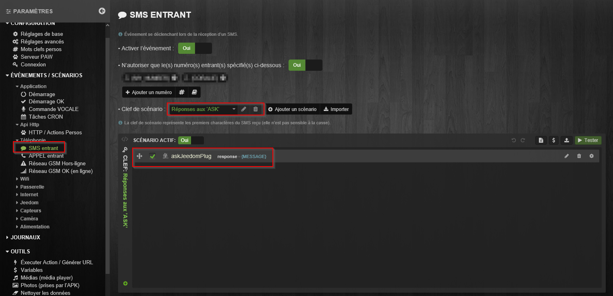
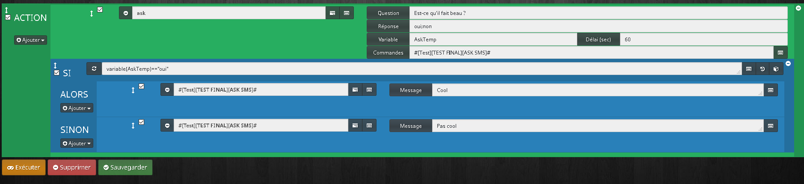
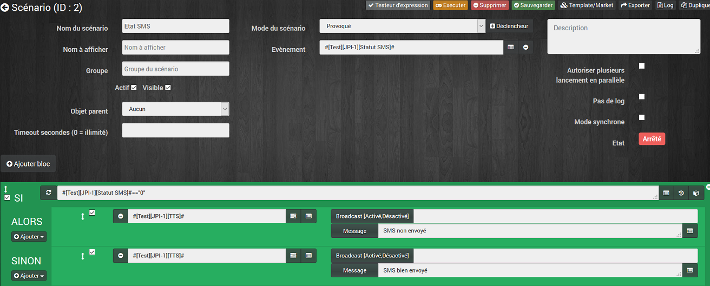

Configuration du plugin
===

## Réglage du cron

Pour régler la fréquence fréquence de recuperation des données, il faut séléctionner le cron dans la partie configuration du plugin.

## Paramètrage d'un équipement

Après avoir créer un équipement, voici la page de configuration

##### Partie 1
Informations à renseigner pour le bon fonctionnement du plugin :

- **Adresse IP :** adresse IP de l'équipement JPI
- **Port :** port de connexon de l'équipement JPI
- **Preset média1 à 4 :** pour les médias (type webradio ou autre) qui pourront être directement lancés depuis le widget

##### Partie 2
- Commandes liées au widget (non modifiable)

##### Partie 3
- Commandes pour vos besoins

##### Partie 4  
- Bouton pour rafraichir le fichier de configuration JPI (par exemple, suite à une mise à jour de l'APK)

##### Partie 5
- Bouton pour ouvrir un modal afin d'accèder directement à la configuration de l'APK JPI (n'apparait que si on est connecté depuis le réseau interne)

Création d'une commande
===
Voici l'onglet qui permet de créer des commandes supplémentaire en mode assistant ou automatique.

Pour ajouter une commande, il faut aller dans l'onglet commande, ensuite vous avez le choix entre utiliser l'assistant de création de commande (bouton 9) ou de rentrer manuellement la commande désirée par copier/coller depuis l'APK JPI (bouton 1)

##### Bouton 2
- Permet de tester la commande

##### Bouton 3
- Permet de lancer l'assistant de modification de commande

##### Menu déroulant 4
- Permet de sélectionner le type de la commande (utile lors de la création de commande de type info)

##### Champ 5
- Nom de la commande

##### Champ 6
- Action JPI

##### Champ 7
- Paramètres obligatoires

##### Champ 8
- Paramètres optionnelles

Exemples d'utilisation
===
### Comment faire un scénario ASK ?
Votre appacation android JPI doit être au minimun en  version 0.92.
Sur l'APK JPI, créer un scénario comme ceci :

Sur votre jeedom, créer une commande sms comme ceci :

Puis créer un scénario comme  ceci :

### Comment s'assurer que la commande d'envoi SMS a bien réussie ?
Dans un scénario, il faut utiliser la commande info "statut SMS"  comme déclencheur.
Voici un exemple :

