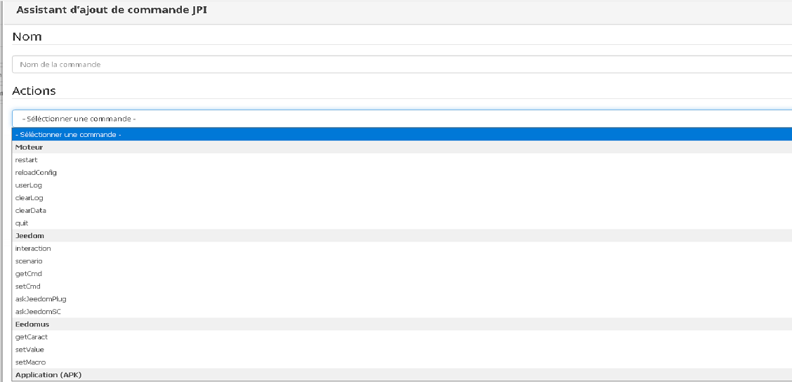
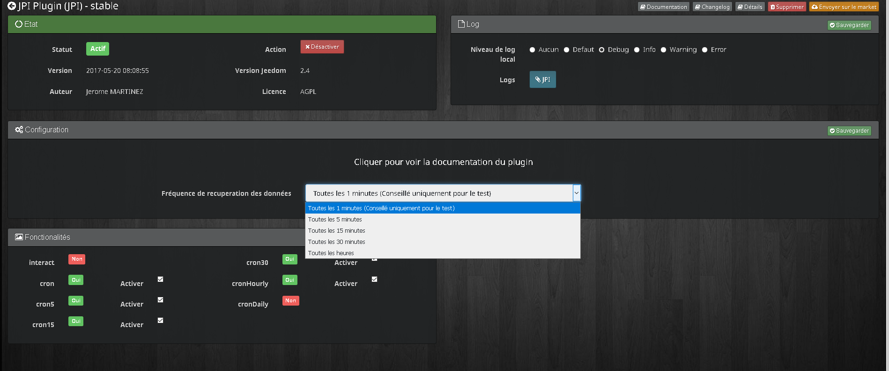
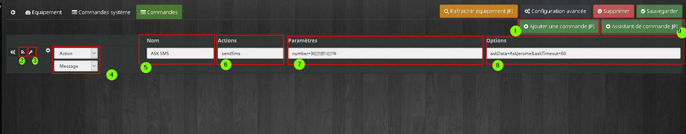

Description
===

Ce plugin permet d'utiliser facilement l'application android *JPI*. Il intégre un assistant de création/modification de commande.

Il dispose aussi d'un widget (dashboard/mobile) d'état et de contrôle de la partie multimédia avec 4 bouttons pré-définis.

*Petit plus du plugin : il est compatible avec la fonction ASK !*

Installation
===

### Pré-requis
Installer PAW server et l'APK JPI sur votre périphérique android

### Comment faire ?
Vous pouvez vous aider du tuto de Guillaume :  https://guillaumebraillon.fr/jeedom-installation-et-configuration-de-jeedom-paw-interface/

Configuration du plugin
===

## Configuration du cron

Pour régler la fréquence fréquence de recuperation des données, il faut séléctionner le cron dans la partie configuration du plugin

## Configuration d'un équipement

Après avoir créer un équipement, voici la page de configuration

##### Partie 1
Informations à renseigner pour le bon fonctionnement du plugin :

- *Adresse IP :* adresse IP de l'équipement JPI
- *Port :* port de connexon de l'équipement JPI
- *Preset média1 à 4 :* pour les médias (type webradio ou autre) qui pourront être directement lancés depuis le widget

##### Partie 2
- Commandes liées au widget (non modifiable)

##### Partie 3
- Commandes pour vos besoins

##### Partie 4  
- Bouton pour rafraichir le fichier de configuration JPI (par exemple, suite à une mise à jour de l'APK)

##### Partie 5
- Bouton pour ouvrir un modal afin d'accèder directement à la configuration de l'APK JPI (n'apparait que si on est connecté depuis le réseau interne)

Création d'une commande
===

Pour ajouter une commande, il faut aller dans l'onglet commande, ensuite vous avez le choix entre utiliser l'assistant de création de commande (bouton 9) ou de rentrer manuellement la commande désirée par copier/coller depuis l'APK JPI (bouton 1)

##### Bouton 2
- Permet de tester la commande

##### Bouton 3
- Permet de lancer l'assistant de modification de commande

##### Menu déroulant 4
- Permet de sélectionner le type de la commande (utile lors de la création de commande de type info)

##### Champ 5
- Nom de la commande

##### Champ 6
- Action JPI

##### Champ 7
- Paramètres obligatoires

##### Champ 8
- Paramètres optionnelles

Changelog
===

### Version 2.01 (Version en cours sur le market)
- Mise à jour de la documentation

### Version 2.0 (2017-11-04 01:02:22)
- Ajout d’un assistant de création/modification de commande
- Création d’un widget mobile
- Récupération dynamique des commandes APK JPI

### Version 1.03 (2017-06-11 22:23:06)
- Ajout d’un widget
- Ajout de commandes JPI
- Amélioration du système de debug
- Suppression de la fonction du broadcast TTS

### Version 1.02 (2017-04-19 20:42:08)
- Ajout des commandes screenOn et screenOff
- Amélioration de l’utilisation du broadcast TTS
- Amélioration de la synchronisation du broadcast TTS

### Version 1.01 (2017-03-20 13:28:38)
- Correction des coquilles
- Amélioration de l’utilisation du broadcast TTS
- Création documentation

### Version 1.0 (version market 2017-03-16 22:01:25)
- Verion initiale
