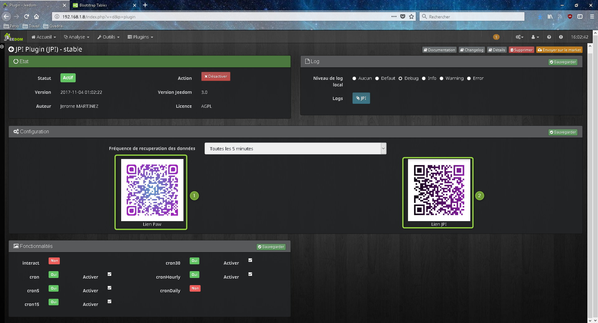

Description
===

Ce plugin permet d'utiliser facilement l'application android **JPI** sans passer par le plugin script. Il intégre un assistant de création/modification de commande.

Il dispose aussi d'un widget (dashboard/mobile) d'état et de contrôle de la partie multimédia avec 4 bouttons pré-définis.

**Petit plus : il est compatible avec la fonction ASK !**

Installation
===

### Pré-requis
Installer PAW server et l'APK JPI sur votre périphérique android

### Comment faire ?

Il faut installer deux applications android sur votre périphérique.
Pour vous simplifier la tâche, vous pouvez utiliser les deux QR Code qui se trouvent dans la partie configuration du plugin.
- Le premier sert à installer le serveur PAW (playstore Goole)
- Le second sert à installer le serveur JPI.

Vous pouvez aussi trouver de l'aide avec le tutoriel de [La DomoPratique](https://www.ladomopratique.com/jeedom-installation-et-configuration-de-jeedom-paw-interface/)
